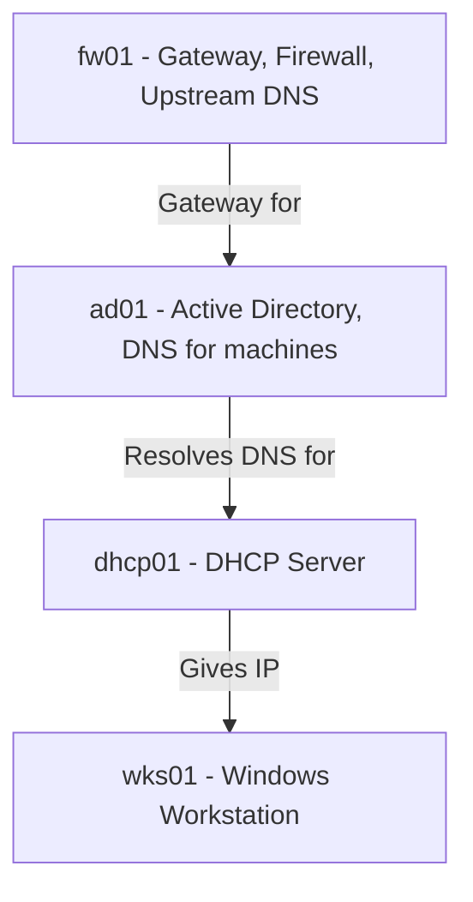

# Prep work for everything exploding

## System Layout

## Services:
* `fw01` - pfSense has upstream dns and is the default gateway - WAN IP: `10.0.17.104/24`, LAN IP: `10.0.5.2/24`
* `ad01` - Domain controller, DNS for machines on AD - IP: `10.0.5.5`
* `dhcp01` - DHCP server, SSH-able - IP: `10.0.5.3`
* `wks01` - Windows 10 Client, AD member - IP: `10.0.5.100` (assigned via DHCP currently, should likely manually assign `.105` or smth before DHCP configured, if required.)

## Reconstruction Plan
1. pfSense is first, follow lab 1.
2. ad01 is next, follow lab 2, and join wks01 to domain.
3. Set up dhcp01 user as per lab 3, don't bother with account creation/shell demos if not required.
4. Follow lab 4 to enable DHCP server on dhcp01, and set workstation to be a DHCP client.
5. Secure SSHD on dhcp01.
6. Follow lab 5 for security policies (if required?).