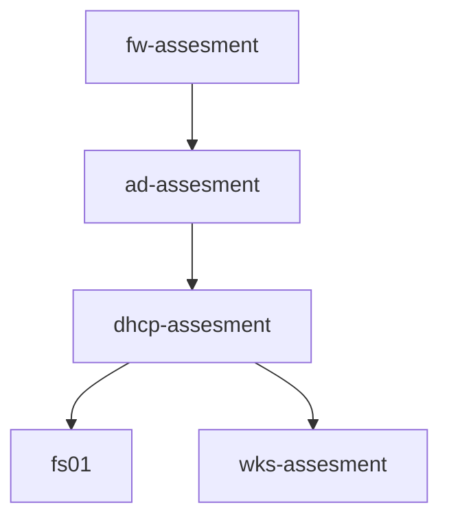

# SYS vCenter Topology (AFTER MIDTERM)

## Machine Descriptions
* `ad-assesment` - `10.0.5.6`, Windows Server 2019, AD domain controller and DNS server for it's machines
* `dhcp-assesment` - `10.0.5.33`, CentOS, dhcpd server
* `fw-assesment` - `10.0.5.2`, pfSense, router, firewall, upstream DNS for `ad01`` and any non-AD machines in LAN
* `wks-assesment` - `10.0.5.150` (DHCP), Windows, workstation on `ad01` AD domain
* `fs01-matt` - `10.0.5.8`, Windows Server, fileserver

## Layout
