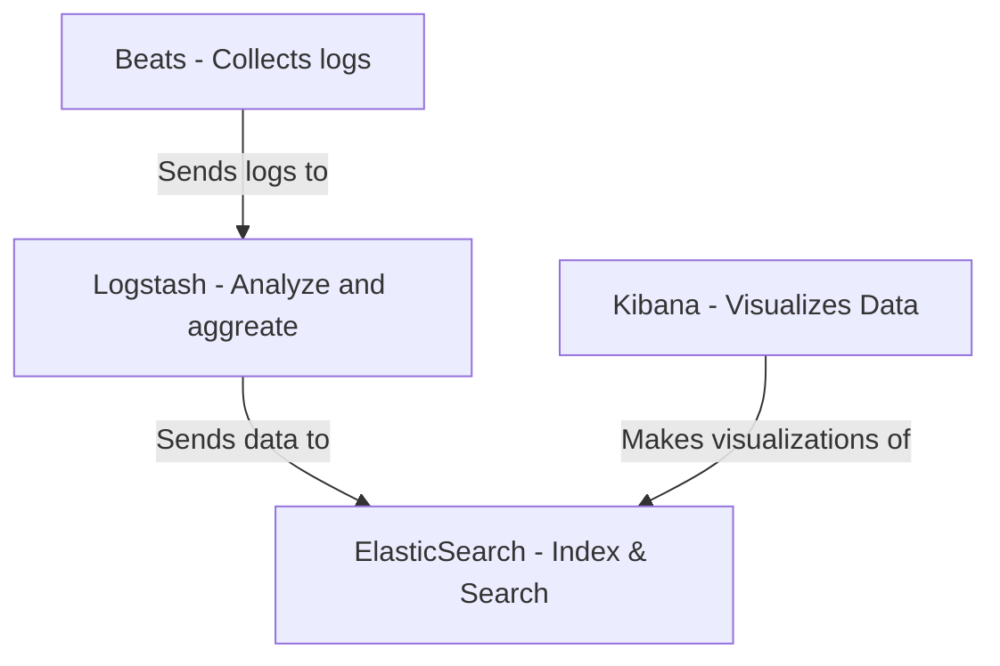

# Week 1
11/7/23

## Architecture
ELK used to be Elasticsearch, Logstash, Kibana
Now there's Beats, so it's "technically" referred to as the "Elastic Stack"

## Components
* Elasticsearch: Search engine
* Logstash: Log aggregator
* Kibana: Visualization element
* Beats: monitoring agent

## Other options for log monitoring
* Splunk (commercial)
* Wazuh (semi-commercial)

## Why
With containers and virtualization, the number of logs to keep an eye on have grown enormously. 
Think from 1 web server per org to like 10 + 15 backend services talking ot each other