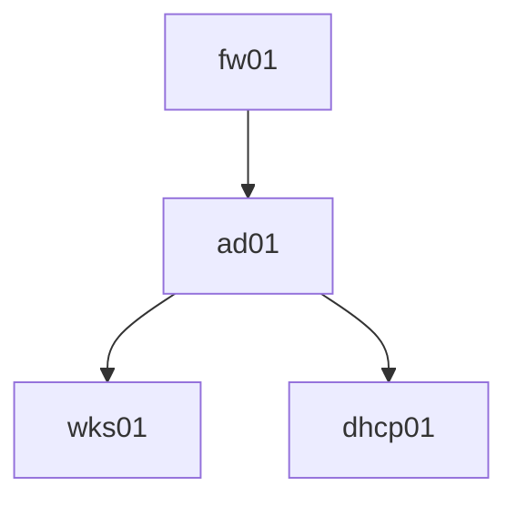

# SYS vCenter Topology (for myself)

## Machine Descriptions
* `ad01` - Windows Server 2019, AD domain controller and DNS server for it's machines
* `dhcp01` - CentOS, **haven't yet used**
* `fw01` - pfSense, router, firewall, upstream DNS for `ad01`` and any non-AD machines in LAN
* `wks01` - Windows, workstation on `ad01` AD domain

## Layout
